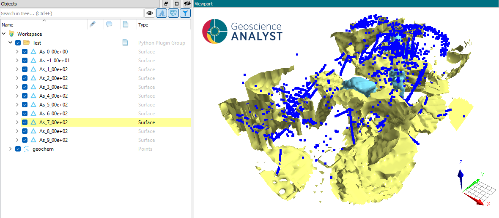
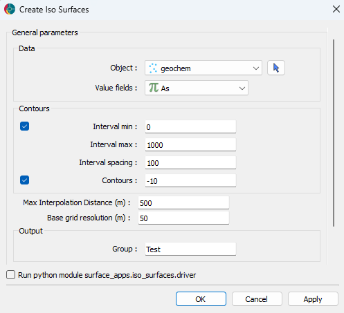

.. _edge_detection:

Iso Surfaces
============

With this application, users can create surfaces from 3D data in a semi-automated
fashion. The application uses a marching cubes algorithm from the
`Scikit-Image <https://scikit-image.org/>`__ open-source package. Surfaces are
exported to `Geoscience ANALYST <https://mirageoscience.com/mining-industry-software/geoscience-analyst/>`__
for viewing and editing.

New user? Visit the `Getting Started <getting_started>`_ page.

Application
-----------

The following sections provide details on the different parameters exposed in the user-interface (``iso_surface.ui.json``).

Data Selection
^^^^^^^^^^^^^^

 - **Object**: Select the target data object from the dropdown list.
 - **Data**: Select the data attribute to use for iso-surface detection.

Contour Parameters
^^^^^^^^^^^^^^^^^^^^

List of parameters controlling the detection and filtering of lineaments.

 - **Interval min**: Interval minimum.
 - **Interval max**: Interval maximum.
 - **Interval spacing**: Interval spacing.

Output Preferences
^^^^^^^^^^^^^^^^^^

 - **Group**: Create a ``Container Group`` entity to store the results.

Need help? Contact us at support@mirageoscience.com
